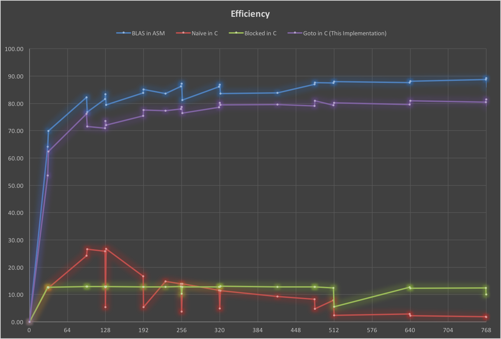
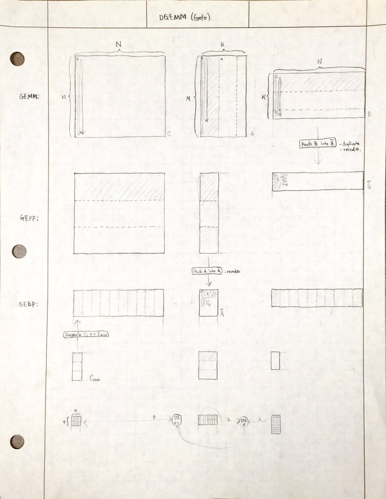

# Goto-Style DGEMM in C

Demonstration of Goto-style DGEMM (Double-precision General Matrix Multiply) in
C with 80% efficiency on AMD Opteron Processor 6136 without using assembly.

The purpose of this code is to show that it is very easy to write fairly
efficient code in C (good algorithm + a bit of compiler hack) without using
assembly. It uses GCC and SSE2 intrinsics.

It is not intended to provide clean portable implementation of DGEMM.

## Efficiency

## Algorithm

## Developer

- Yutaka Tsutano at University of Nebraska-Lincoln.
